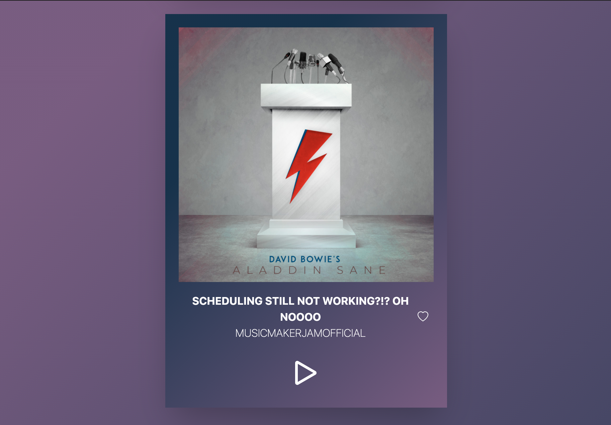

# JAM :rocket:




## Overview

This coding challenge consists of a single page web application that:

- Uses [Flow.js](https://flow.org/) to set types within the actions/data.js file
- Creates a list of songs showing "Song Title", "Thumbnail Image", "Play/Pause Button", and "Like Button"
- Shares state across components using [Redux](https://redux.js.org/)
- Uses [Tailwindcss](https://tailwindcss.com/) as a CSS framework
- Is designed having in mind modularity & scalability; Follows the latest coding standards guidelines
- Performs basic unity testing: the correct rendering of the 'Song' component using [testing-library-react](https://testing-library.com/docs/react-testing-library/intro/)
- Is hosted on [Netlify](https://jam-challenge.netlify.app/)
- Has used [Gitflow](https://www.atlassian.com/git/tutorials/comparing-workflows/gitflow-workflow) as a Git workflow

[Checkout the demo](https://jam-challenge.netlify.app/)

## Technologies used

- React v17.0.1
- Redux v4.0.5
- Flow-bin v0.149.0
- Babel v7.13.16
- React-redux v7.2.2
- Redux-thunk v2.3.0
- Redux-devtools-extension v2.13.8
- Axios v0.21.1
- Tailwindcss v1.9.6
- React-icons v4.2.0
- React-alert v7.0.2

## Run locally :hammer_and_wrench:

To run the app locally, clone the repo and install the app using:

```
  $ git clone https://github.com/guarmo/jam
  $ cd jam
  $ npm install
  $ npm start
```

Your app should now be running on [localhost:3000](http://localhost:3000/).

## Unity testing :hammer_and_wrench:

To run the tests, after the installation run:

```
  $ npm run test
```

## Contributors :sparkler:

This project is designed and developed by [Armando Guarino](https://armandoguarino.dev)

## Contributing

Thanks for your interest in contributing! There are many ways to contribute to this project. Find out how [here](https://gist.github.com/MarcDiethelm/7303312).

Wishlist:

- Improve GUI
- Implement like functionality 
- Implement Flow to more components
- Add further Unity Testing

## License

This project is open source and available under the [MIT License](LICENSE.md).
